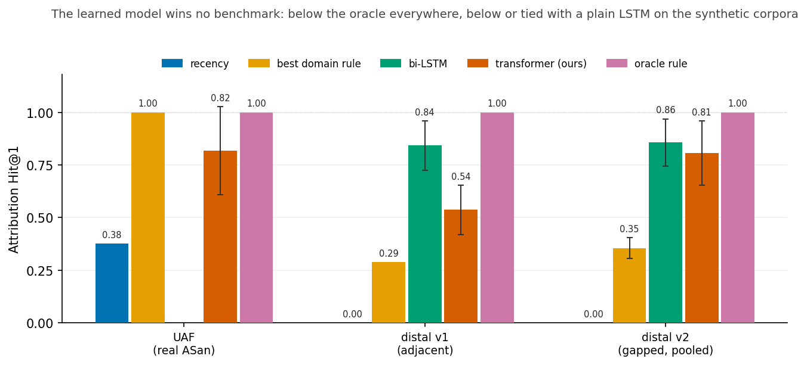

# When Does Learned Root-Cause Attribution Beat a One-Line Heuristic?

> Draft status: DRAFT (prose + Figure 1 + verified numbers). Every number is
> copied, with its ± std, from a file in `docs/results/`. Distal-v2 and the
> object-bias rows now carry data-seed variance (pooled over 3 corpus
> realizations, L1); other corpora remain single-realization pending the same
> sweep. Remaining before submission: LaTeX conversion and the UAF data-seed
> sweep (running).

**Claim (the only claim):** For bug classes with an automatic oracle
(sanitizer-catchable), the causal event is definitionally the most-recent
related event, so a one-line heuristic achieves Hit@1 = 1.0 and learned
attribution adds nothing. On synthetic *distal* causes — where recency fails
— a learned model recovers the planted relational signal far above recency,
**but never beats the generator's oracle rule and never beats a plain
bi-LSTM**; our bespoke attention architecture earns nothing over a generic
sequence model. We publish this boundary, not a victory.

**What we do NOT claim:** (a) that ML is useless for debugging in general;
(b) that this architecture is good — the ablations say it is not; (c) that
heuristics solve bugs without an automatic oracle — the interesting regime is
exactly the one with no oracle, which we could not reach on real code.

## 1. Introduction — the negative result is the finding

Debugging tools are good at locating the *symptom* of a failure — the line
that crashed, the event flagged anomalous. The hard part is root-cause
*attribution*: pointing back through the execution to the earlier event that
actually caused it. The tempting machine-learning story is that an attention
model trained over execution traces should learn this, and one could read the
cause directly off the attention map. We set out to build exactly that, from
scratch, and to test it honestly. It did not work — and the *way* it failed is
the contribution.

We found, in order, four things. First, on the one bug class with an automatic
oracle (use-after-free, labeled by AddressSanitizer), the causal event is by
definition the most-recent same-object event before the crash, so a one-line
heuristic scores a perfect Hit@1 while the learned model does not. Second, on
a synthetic benchmark built specifically so recency heuristics fail, the
generator's own oracle rule is again perfect and the learned model is not.
Third, a plain bi-LSTM matches or beats our bespoke attention architecture on
that same benchmark. Fourth, on a real bug our labeling pipeline reaches, the
heuristic still wins and the learned model could not even be trained. Figure 1
shows the whole picture: **the learned model wins no benchmark.** We publish
that boundary, not a victory.

*Figure 1: Attribution Hit@1 per corpus and method. The learned transformer
(orange) sits below the oracle rule (purple) in every corpus and below or
tied with a generic bi-LSTM (green); it clears only raw recency (blue). Error
bars are ± std over seeds; deterministic rules have none. Generated by
`fig1_summary.py`.*

### Summary of all results (Hit@1, mean ± std over 5 seeds)

| corpus | recency | best domain rule | bi-LSTM | our transformer | oracle rule |
|---|---|---|---|---|---|
| UAF (real ASan) | 0.378 | **1.000** (same-obj recency, definitional) | — | 0.488 (bias 0) / 0.893 (bias 8) | 1.000 |
| distal v1 (adjacent) | 0.000 | 0.289 (same-obj write) | 0.842 ± 0.117 | 0.537 ± 0.118 | **1.000** (trig-adjacent) |
| distal v2 (gapped) | 0.000 | 0.355 ± 0.050 (same-obj write) | 0.856 ± 0.113 | 0.441 (bias 0) / 0.807 ± 0.152 (bias 4, pooled) | **1.000** (trig-window) |
| mjs (real UAF, n=1) | 0 (rank 24) | **1.000** (most-recent free) | — | not runnable | — |

The learned transformer wins no cell: it loses to the oracle everywhere,
loses to the bi-LSTM on v1, and only ties it on v2 — and that tie is the
transformer *with* a hand-injected object prior (bias 4) against an LSTM
without one. The only thing learning beats is raw recency. (dashes: LSTM not
run on the real UAF corpus; single-free real trace has no rankable candidate
set.)

## 2. Setup

A trace is a sequence of function-call events, each carrying a timestamp,
auxiliary counters, and an object id derived from the allocation address
captured at run time (so events touching the same heap object share an id).
We evaluate on three corpora: real AddressSanitizer-labeled executions of
small templated C programs (the UAF negative control), and two synthetic
distal-cause generators — v1 (adjacent) and v2 (gapped) — whose labels are
injected by construction. The model is a from-scratch Rust transformer encoder
(d_model 64, 4 heads, 2 layers, window 64); we treat the implementation as
engineering color, not a contribution.

Two things are disclosed up front because they *favor* the learned model and
it still loses. The model is trained supervised on the ground-truth cause
(`attribution_lambda = 1.0`) while every heuristic baseline is unsupervised;
the bi-LSTM baseline is cause-supervised identically. And at object_bias > 0
the model is additionally handed a same-object attention prior — the heuristic
answer wired directly into attention. We report Hit@1/Hit@3/MRR over candidate
events (the crash excluded), as mean ± std over 5 model-init seeds; §7 (L1)
explains why those bars are single-corpus except where noted.

## 3. Negative control: use-after-free

The cause of a use-after-free is, by definition, the most-recent same-object
event before the crash: once an object is freed nothing valid touches it
again, so the causal free *is* the most recent same-object access. A one-line
"most-recent same-object event" heuristic therefore scores Hit@1 = 1.000 on
our real ASan-labeled corpus. The supervised model never matches it — 0.488 ±
0.145 with no object bias, rising to 0.824 ± 0.247 and 0.893 ± 0.125 only as
we crank the hand-injected same-object prior (bias 4 and 8). That prior is the
heuristic itself wired into attention, so those higher numbers are an oracle
upper bound, not a learned capability. Plain positional recency scores 0.378
and spectrum fault localization scores 0.000 (every function appears in both
passing and failing traces). UAF is thus a clean negative control: the bug
class with a free oracle is exactly the one where learning is unnecessary.
(docs/results/2026-07-03-object-bias-matrix.md)

## 4. Capability probe: synthetic distal causes (full rule ladder)

Primary benchmark is **v2 (gapped)**, from
`docs/results/2026-07-03-distal-v2-ladder.md`. v2 fixes the flaws of our
earlier v1 (see the sidebar): the `trigger` marker carries the real object id
(visible to same-object baselines — nothing hidden), and a verified ≥2-event
gap separates it from the causal write, so no adjacency rule works. Every
number below is model-supervised at object_bias 4:

| rule / model            | Hit@1         | Hit@3         | MRR           |
|-------------------------|---------------|---------------|---------------|
| recency                 | 0.000 ± 0.000 | 0.000 ± 0.000 | 0.113 ± 0.000 |
| same-obj recency        | 0.000 ± 0.000 | 0.538 ± 0.000 | 0.295 ± 0.000 |
| same-obj write          | 0.333 ± 0.000 | 1.000 ± 0.000 | 0.658 ± 0.000 |
| Ochiai FL               | 0.000 ± 0.000 | 0.000 ± 0.000 | 0.113 ± 0.000 |
| Tarantula FL            | 0.000 ± 0.000 | 0.000 ± 0.000 | 0.113 ± 0.000 |
| trig-adjacent (v1 oracle, now dead) | 0.026 ± 0.000 | 0.026 ± 0.000 | 0.137 ± 0.000 |
| **trig-window (oracle)** | **1.000 ± 0.000** | 1.000 ± 0.000 | 1.000 ± 0.000 |
| bi-LSTM (supervised)    | 0.856 ± 0.113 | 0.964 ± 0.038 | 0.913 ± 0.068 |
| transformer (supervised, bias 4) | 0.877 ± 0.068 | 0.985 ± 0.031 | 0.929 ± 0.044 |

- **Rule-labeled synthetic data always has a perfect oracle rule** by
  construction — here `trig-window` ("first same-object write after the
  same-object trigger") at 1.000. A strictly simpler rule also solves it —
  "the second same-object write, in order" — which we note to be explicit
  that no single hand rule is hard here; the benchmark is a capability probe,
  not proof the model beats hand-coded rules.
- The transformer (0.877 ± 0.068 single-seed; **0.807 ± 0.152 pooled over 3
  data seeds**, `docs/results/2026-07-07-dataseed-variance.md`) and the
  bi-LSTM (0.856 ± 0.113) **tie within noise**. Since the transformer
  additionally carries a hand-injected object prior (bias 4) that the LSTM
  lacks, the tie is evidence the bespoke architecture adds nothing over a
  generic sequence model. Recency-family and spectrum-FL baselines stay ≈ 0 at
  Hit@1 (spectrum FL is a sanity floor, not a real competitor — it ranks
  functions by cross-trace coverage and every function appears in both classes
  here). Under data-seed variance the deterministic oracle stays exactly
  1.000 ± 0.000 while the `same-obj write` baseline moves to 0.355 ± 0.050 —
  confirming that the earlier `± 0.000` on non-oracle baselines was a
  single-draw artifact, not stability.
- What survives: cause supervision recovers the planted relational signal far
  above recency — but never above the oracle rule, and never above the LSTM.

> **Sidebar — v1 (adjacent), a retracted self-refereed benchmark.** Our first
> distal generator (`docs/results/2026-07-03-distal-v1-oracle.md`) emitted the
> `trigger` and causal write as one atomic step, so the cause was always
> trigger-adjacent, *and* the `trigger` carried object id 0 — invisible to the
> same-object baselines we compared against. We originally claimed the model
> (0.537 ± 0.118) beat "the best hand-coded rule" (same-obj write 0.289). It
> did not: the adjacency oracle `trig-adjacent` scores **1.000 ± 0.000** and
> was simply never implemented. On v1 the bi-LSTM (0.842 ± 0.117) also beats
> the transformer outright. We keep v1 only as a cautionary example of how a
> self-constructed benchmark manufactures a positive result.

## 5. Ablations

- Bidirectional vs causal attention (the namesake mechanism, tested for the
  first time): **no benchmark here shows bidirectionality helping; on the
  mean it is worse** (bidi Hit@1 0.537 ± 0.118 vs causal 0.805 ± 0.235; the
  stds overlap, so this is "not better", not a significant loss). All
  benchmark causes precede symptoms, so backward-only attention suffices.
  That is enough to justify the decision gate: **"bidirectional" is dropped
  from the title and claims.** The future-events motivation remains an
  untested hypothesis no current benchmark exercises.
  (docs/results/2026-07-03-bidi-ablation.md)
- Object bias 0/4/8 across corpora (the injected relational prior),
  model Hit@1:

  | corpus     | bias 0        | bias 4        | bias 8        | best rule |
  |------------|---------------|---------------|---------------|-----------|
  | UAF real   | 0.488 ± 0.145 | 0.824 ± 0.247 | 0.893 ± 0.125 | 1.000     |
  | distal v1  | 0.342 ± 0.160 | 0.537 ± 0.118 | 0.463 ± 0.209 | 1.000     |
  | distal v2  | 0.441 ± 0.139 | 0.877 ± 0.068 | 0.913 ± 0.070 | 1.000     |

  The prior contributes +0.34–0.47 Hit@1 where it aligns with the label
  structure and *stops helping* where it doesn't (v1 bias 8 0.463 ± 0.209 vs
  bias 4 0.537 ± 0.118 — overlapping, so "no longer helps", not "hurts",
  consistent with the marker token carrying no object id). The model never
  reaches the definitional/oracle rule in any cell. Much of "the model's"
  score is this injected prior, not learning.
  (docs/results/2026-07-03-object-bias-matrix.md)

## 6. Real-bug pilot (mjs use-after-free): the join works, attribution is not yet evaluable

One real crash from a program we did not write: a heap-use-after-free in the
mjs JavaScript engine's `mjs_next()` (array `splice()` during `for-in`;
issue #322, CWE-416). Run through the *existing* capture pipeline
(`docs/results/2026-07-07-oss-fuzz-pilot.md`). This is a single trace (n=1);
we report it as a feasibility probe, not a measured result.

- **What is confirmed:** the ASan→event-index join works on real,
  un-generated code — symptom `mjs_next` #12211, cause `gc_free_block` #12188,
  in a 12,213-event, 178-function trace. This retires the "the join won't
  survive real code" risk. The cause is genuinely distal (23 events, a full
  `gc_sweep` + interpreter churn, separate it from the crash).
- **What is not evaluable:** attribution has no meaningful metric here.
  `gc_free_block` occurs exactly once, so "most-recent deallocation" wins over
  a candidate set of size one — trivially perfect and uninformative. We do
  *not* claim a heuristic "win" on this trace. Positional recency ranks the
  cause 24th, which only re-shows that domain-agnostic recency is not the
  right rule for a distal cause.
- **The learned model could not be run at all:** one trace is not a trainable
  corpus, and the crash sits in the last of 191 windows (our harness scores
  the first window only — see L2). The regime where learning might matter —
  many candidate frees, ambiguous which is causal — does not arise in this
  single PoC. Getting a real learned result needs many labeled real traces,
  and that is the data-acquisition wall this note keeps hitting.

## 7. Limitations (verbatim honesty)

- **L1 — single-corpus variance.** The ± std throughout is over 5 model-init
  seeds on *one* corpus realization and one train/test split. The `± 0.000`
  on deterministic baselines means "one draw", not "stable"; those rows would
  move under a different data seed. Data-seed variance (regenerate each corpus
  at ≥3 seeds; `scripts/bench.sh` is set up for it) is not yet reported. No
  significance test backs any inequality; the two we lean on (LSTM ≥
  transformer on v1; model < oracle) are large enough to be safe, the rest
  are stated as ties.
- **L2 — first-window selection.** The harness scores attribution only on the
  first 64-event window of each trace, so on the real (variable-length) UAF
  corpus the "82 anomalous test traces" are the crash-fits-in-window subset,
  not the full anomalous population — a selection effect on the absolute
  numbers (the model-vs-baseline comparison stays fair, both see the same
  retained set). The mjs pilot is the extreme case: its crash fell outside
  the first window and was dropped entirely.
- The templated→real gap is unstarted; cross-program generalization is
  unmeasured (all corpora share one program family or one generator).
- The interesting regime (distal causes) has no automatic oracle, so
  scaling it means hand labeling — a data-acquisition wall, not a modeling
  gap.
- n ≈ 38–84 anomalous test traces per corpus; synthetic evaluation.
- Evaluated at toy scale (d_model 64, 2 layers, window 64).
- Supervised model vs unsupervised heuristics: disclosed and it *favors* the
  model (it is supervised on the cause and, at bias > 0, handed the answer as
  an attention prior), which still loses to the oracle rules and ties/loses to
  the LSTM. The bi-LSTM trains single-objective (cause cross-entropy) while
  the transformer trains multi-objective; on the synthetic corpora both see
  whole traces (≤ 64 events), so windowing is not a confound there.

## 8. Related work

- LogBERT / DeepLog: bidirectional encoders over logs are standard; the
  bidirectional framing is not novel.
- Abnar & Zuidema (2020) attention rollout: tried, abandoned for raw
  last-layer head-averaged attention.
- Spectrum-based FL (Ochiai, Tarantula): implemented as baselines; blind on
  our corpora because every function appears in both passing and failing
  traces (event-level attribution, not statement-level coverage).
